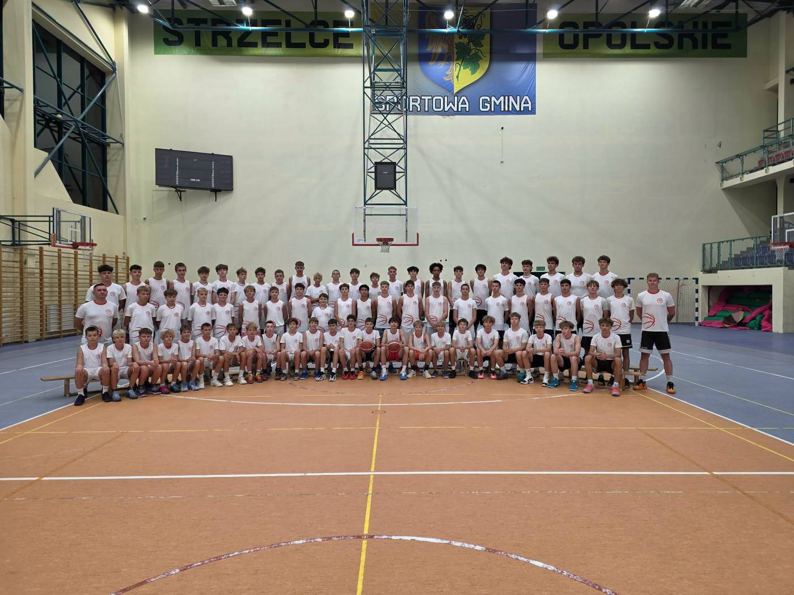
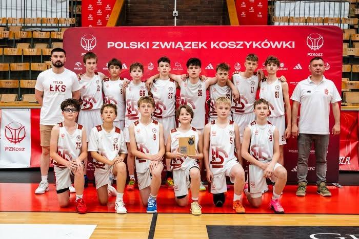
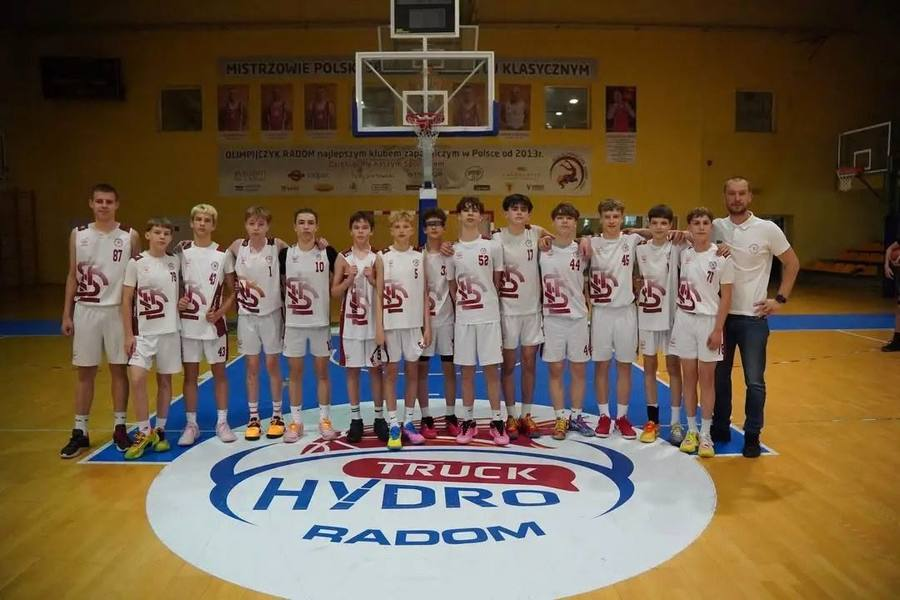
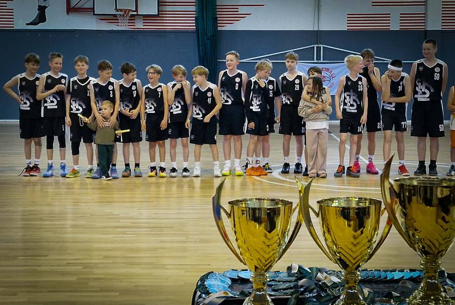
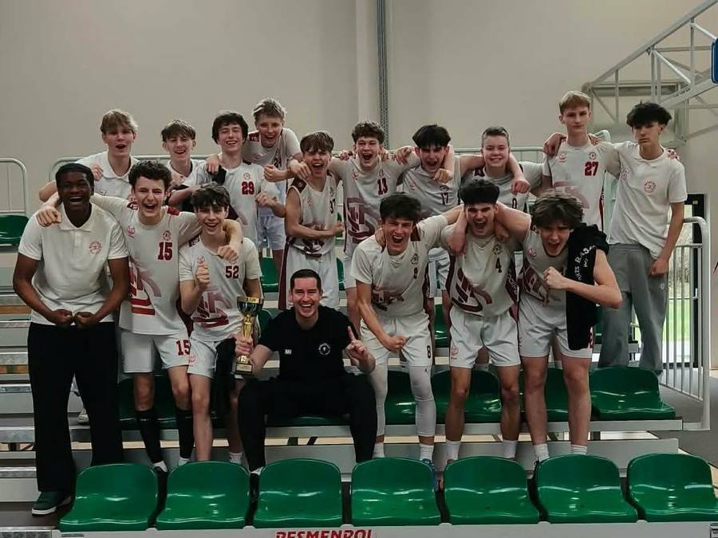

# Akademia

{ .lks-team-photo }

ŁKS KM Szkoła Gortata to sekcje młodzieżowe Łódzkiego Klubu Sportowego
Koszykówka Męska. Prowadzimy siedem grup młodzieżowych i zespół seniorski
w 2 lidze — zawodnik, który przychodzi do nas jako dziesięciolatek, może
grać w klubie aż do dorosłej koszykówki, nie zmieniając barw.

## :material-target: Po co to robimy

### :material-basketball: Misja
Uczymy koszykówki na najwyższym możliwym poziomie — a przy okazji pracy
zespołowej, odpowiedzialności i wiary we własne siły.

### :material-telescope: Wizja
Chcemy być pierwszym wyborem dla rodzin w województwie łódzkim, które szukają
profesjonalnej i przyjaznej akademii koszykówki.

### :material-hand-heart-outline: Wartości
**Szacunek** · **Zaangażowanie** · **Zespół** · **Rozwój** — sukces drużyny
przed sukcesem jednostki, codzienna praca ponad talent.

## :material-trophy-outline: Osiągnięcia

- :material-medal-outline: **U13** — udział w Mistrzostwach Polski
- :material-medal-outline: **U15** — udział w Mistrzostwach Polski
- :material-medal-outline: **U12** — mistrzostwo województwa łódzkiego
- :material-medal-outline: **U16** — awans

**Uzupełnij:** dokładne miejsca i sezony przy każdym osiągnięciu oraz pełną
listę wyników wszystkich roczników z ostatnich sezonów.

## :material-whistle-outline: Kadra trenerska

Każdą grupą opiekuje się trener prowadzący — to do niego kierujesz pytania
o konkretną drużynę. Kontakt znajdziesz na stronie grupy w
[Strefie dla rodzica](strefa-rodzica/index.md).

| Grupa | Trener prowadzący |
|-------|-------------------|
| U11 | Adam Krzysztoń |
| U12 | Radosław Darnikowski |
| U13 | Maciej Kochaniak |
| U14 | Maciej Rudziński |
| U15 | Maciej Puczyński |
| U17 | Patryk Dembowski |
| U19 | Piotr Trepka |
| 2 liga | Piotr Trepka |

**Koordynatorzy grup młodzieżowych:** Norbert Kulon, Maciej Kochaniak

**Uzupełnij:** klasy licencji PZKosz, staż trenerski i zdjęcia portretowe
kadry. Zdjęcia trenerów to jedyna kategoria, której obecnie brakuje —
a dla rodzica twarz trenera znaczy więcej niż akapit opisu.

## :material-book-open-page-variant-outline: Historia

**Uzupełnij:** rok założenia oraz 2–3 akapity o historii klubu — jak się
rozwijał i jakie kamienie milowe warto podkreślić.

[Zobacz grupy wiekowe](strefa-rodzica/index.md){ .md-button .md-button--primary }
[Zapytaj o zapisy](dolacz.md){ .md-button }
