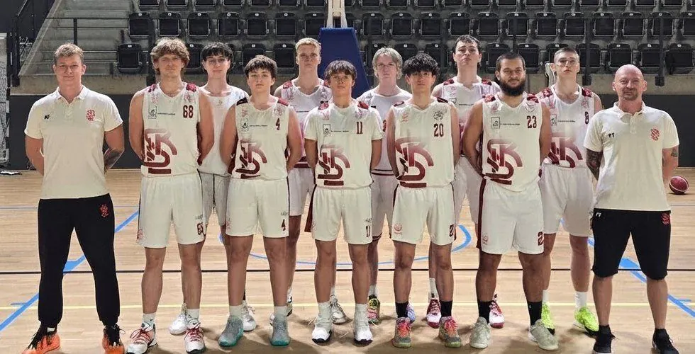

<nav class="lks-teamswitch" aria-label="Wybierz drużynę">
  <a class="lks-teamswitch__chip" href="../naborowa/">Grupy naborowe</a>
  <a class="lks-teamswitch__chip" href="../u11/">U11</a>
  <a class="lks-teamswitch__chip" href="../u12/">U12</a>
  <a class="lks-teamswitch__chip" href="../u13/">U13</a>
  <a class="lks-teamswitch__chip" href="../u14/">U14</a>
  <a class="lks-teamswitch__chip" href="../u15/">U15</a>
  <a class="lks-teamswitch__chip" href="../u17/">U17</a>
  <a class="lks-teamswitch__chip" href="../u19/">U19</a>
  <a class="lks-teamswitch__chip is-active" href="../dwa-liga/" aria-current="page">2. liga</a>
</nav>

# ŁKS Politechnika Łódzka

{ .lks-team-photo width="980" height="500" }

To zespół seniorski Klubu, który gra w 2. lidze jako **ŁKS Politechnika Łódzka**. Zamyka naszą piramidę szkoleniową i czeka na zawodników po wieku juniorskim.

:material-whistle-outline: **Trener prowadzący**
: **Piotr Trepka**

:material-account-group-outline: **Wiek zawodników**
: seniorzy

:material-trophy-outline: **Rozgrywki**
: 2.&nbsp;liga

:material-account-tie-outline: **Kontakt w sprawach drużyny**
: Biuro Klubu: [733&nbsp;34&nbsp;**1908**](tel:+48733341908), [biuro@lkskm.pl](mailto:biuro@lkskm.pl)

## :material-handshake-outline: Współpraca z Politechniką Łódzką

Politechnika Łódzka od wielu sezonów jest partnerem naszego Klubu. Dzięki temu Łódź ma
ambitny zespół seniorski, a nasi młodzi zawodnicy — cel, do którego dążą.

-   ### :material-stairs-up: Bez zmiany klubu

    Po U19 zawodnik nie musi szukać nowego klubu ani wyjeżdżać z Łodzi.
    Czeka na niego 2. liga — w tych samych barwach.

-   ### :material-school-outline: Koszykówka i studia

    Współpraca z uczelnią pokazuje, że sport na wysokim poziomie
    i studia mogą iść w parze.

-   ### :material-chart-line: Stabilność na lata

    Wieloletnia współpraca z Politechniką pozwala planować rozwój zespołu
    na kolejne sezony.

-   ### :material-city-variant-outline: Łódź gra razem

    Klub i jedna z największych łódzkich uczelni działają razem —
    dla miasta i jego młodzieży.

Dziękujemy [Politechnice Łódzkiej](https://www.p.lodz.pl/) za wieloletnią współpracę.
Z zespołem gra także nasz strategiczny sponsor: [CoolPack](https://e-sklep.coolpack.com.pl/){ target=_blank rel="noopener" }.
Twoja firma też może wspierać zespół — [zostań sponsorem](../sponsorzy.md).

## :material-calendar-clock-outline: Harmonogram treningów

| Dzień | Godziny | Hala |
| --- | --- | --- |
| Poniedziałek | 19:30–21:00 | [Hala Sportowa MOSiR Skorupki](https://maps.app.goo.gl/fvH7jdGYqaDKhrap9){ target=_blank rel="noopener" } ul. ks. Ignacego Skorupki 21 |
| Wtorek | 19:30–21:00 | [Zatoka Sportu PŁ](https://maps.app.goo.gl/diVwFnzyyFM7oUeJA){ target=_blank rel="noopener" } Al. Politechniki 10 |
| Środa | 20:00–21:30 | [Zatoka Sportu PŁ](https://maps.app.goo.gl/diVwFnzyyFM7oUeJA){ target=_blank rel="noopener" } Al. Politechniki 10 |
| Czwartek | 19:30–21:30 | [Hala Sportowa MOSiR Skorupki](https://maps.app.goo.gl/fvH7jdGYqaDKhrap9){ target=_blank rel="noopener" } ul. ks. Ignacego Skorupki 21 |
| Piątek | 20:00–21:30 | [Zatoka Sportu PŁ](https://maps.app.goo.gl/diVwFnzyyFM7oUeJA){ target=_blank rel="noopener" } Al. Politechniki 10 |

O zmianach w harmonogramie informujemy zawodników. Pytania kieruj do biura Klubu.
