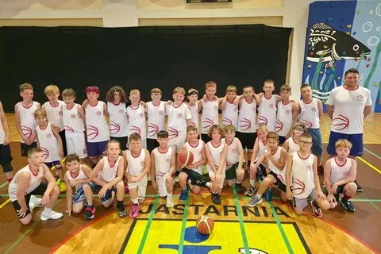
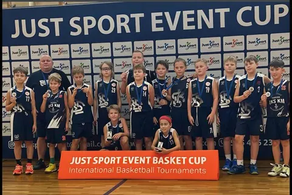
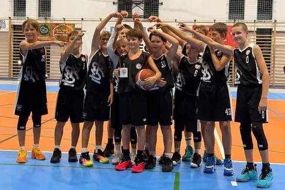
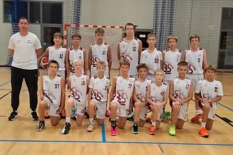
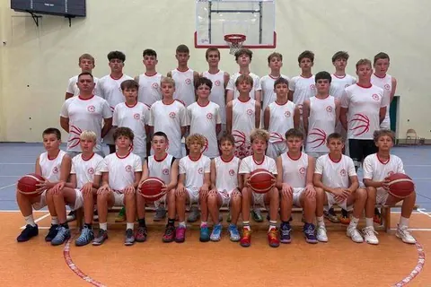
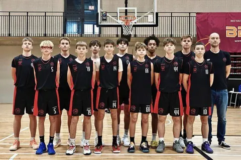
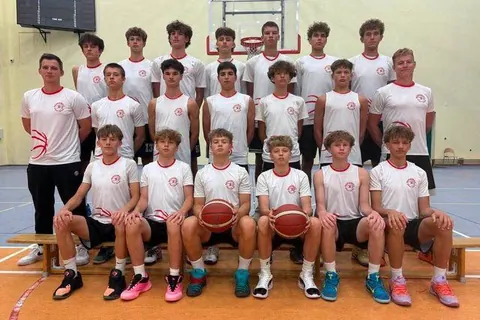
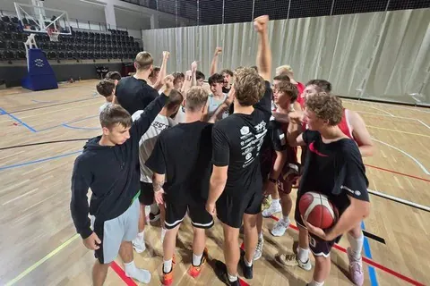
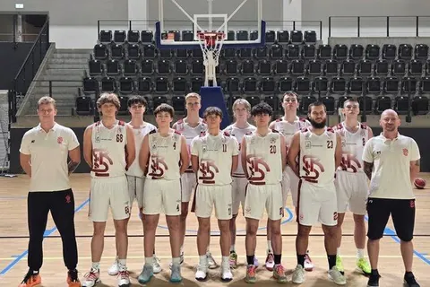

---
search:
  boost: 2
title: Nasze drużyny
description: >-
  Drużyny ŁKS Koszykówka Męska — od grup naborowych po zespół seniorski
  w 2. lidze. Trenerzy i harmonogramy treningów.
---

# Nasze drużyny

Od grup naborowych (rocznik 2017 i młodsi) po zespół seniorski w 2. lidze.
Każda drużyna przyjmuje chłopców z podanego rocznika i młodszych.
Na stronie każdej drużyny znajdziesz trenera i harmonogram treningów. W U12, U13 i U15 mamy po dwie
drużyny, każdą z własnym trenerem.

<a class="lks-group" href="naborowa/">
  Nabór otwarty
  Grupy naborowe
  chłopcy urodzeni w&nbsp;2017&nbsp;roku i&nbsp;młodsi
</a>

<a class="lks-group" href="u11/">
  
  U11
  A.&nbsp;Krzysztoń
  chłopcy urodzeni w&nbsp;2016&nbsp;roku i&nbsp;młodsi
</a>

<a class="lks-group" href="u12/">
  2 drużyny
  U12
  R.&nbsp;Darnikowski W.&nbsp;Szewczyk
  chłopcy urodzeni w&nbsp;2015&nbsp;roku i&nbsp;młodsi
</a>

<a class="lks-group" href="u13/">
  2 drużyny
  U13
  M.&nbsp;Kochaniak M.&nbsp;Markowicz
  chłopcy urodzeni w&nbsp;2014&nbsp;roku i&nbsp;młodsi
</a>

<a class="lks-group" href="u14/">
  
  U14
  M.&nbsp;Rudziński
  chłopcy urodzeni w&nbsp;2013&nbsp;roku i&nbsp;młodsi
</a>

<a class="lks-group" href="u15/">
  2 drużyny
  U15
  M.&nbsp;Puczyński B.&nbsp;Frątczak
  chłopcy urodzeni w&nbsp;2012&nbsp;roku i&nbsp;młodsi
</a>

<a class="lks-group" href="u17/">
  
  U17
  P.&nbsp;Dembowski
  chłopcy urodzeni w&nbsp;2010&nbsp;roku i&nbsp;młodsi
</a>

<a class="lks-group" href="u19/">
  
  U19
  P.&nbsp;Trepka
  chłopcy urodzeni w&nbsp;2008&nbsp;roku i&nbsp;młodsi
</a>

<a class="lks-group lks-group--wide" href="dwa-liga/">
  
  SeniorzyŁKS Politechnika Łódzka
  P.&nbsp;Trepka
  zespół seniorski · 2.&nbsp;liga
</a>

## Wyniki rozgrywek

Wyniki, terminarze i tabele rozgrywek znajdziesz na stronie Łódzkiego
Związku Koszykówki.

[:material-open-in-new: Wyniki na lzkosz.pl](https://www.lzkosz.pl/){ .md-button .md-button--primary }

## Koordynatorzy

W sprawach drużyny skontaktuj się najpierw z właściwym koordynatorem:

- **Szczepan Prasol** — grupy naborowe i zapisy do nich. Tel.: [695 262 230](tel:+48695262230), [szczepan.prasol@lkskm.pl](mailto:szczepan.prasol@lkskm.pl)
- **Maciej Kochaniak** — sprawy organizacyjne i zapisy do drużyn U11–U19. Tel.: [508 206 918](tel:+48508206918), [maciej.kochaniak@lkskm.pl](mailto:maciej.kochaniak@lkskm.pl)
- **Norbert Kulon** — sprawy sportowe: trening, poziom, skład drużyny. [norbert.kulon@lkskm.pl](mailto:norbert.kulon@lkskm.pl)

## Biuro Klubu

:material-map-marker-outline: **Adres**
: [Al. Unii Lubelskiej 2, 94-020 Łódź](https://www.google.com/maps/search/?api=1&query=Al.+Unii+Lubelskiej+2,+94-020+%C5%81%C3%B3d%C5%BA), II&nbsp;piętro

:material-phone-outline: **Telefon**
: [733&nbsp;34&nbsp;**1908**](tel:+48733341908)

:material-email-outline: **E-mail**
: [biuro@lkskm.pl](mailto:biuro@lkskm.pl)

