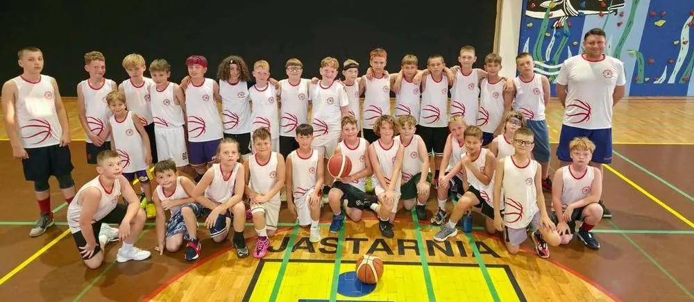

---
search:
  boost: 2
title: Grupy naborowe
description: >-
  Grupy naborowe ŁKS Koszykówka Męska — chłopcy urodzeni w 2017 roku i młodsi,
  treningi w czterech szkołach podstawowych w Łodzi, harmonogram i trenerzy,
  nabór otwarty przez cały sezon.
---

<nav class="lks-teamswitch" aria-label="Wybierz drużynę">
  <a class="lks-teamswitch__chip is-active" href="../naborowa/" aria-current="page">Grupy naborowe</a>
  <a class="lks-teamswitch__chip" href="../u11/">U11</a>
  <a class="lks-teamswitch__chip" href="../u12/">U12</a>
  <a class="lks-teamswitch__chip" href="../u13/">U13</a>
  <a class="lks-teamswitch__chip" href="../u14/">U14</a>
  <a class="lks-teamswitch__chip" href="../u15/">U15</a>
  <a class="lks-teamswitch__chip" href="../u17/">U17</a>
  <a class="lks-teamswitch__chip" href="../u19/">U19</a>
  <a class="lks-teamswitch__chip" href="../dwa-liga/">2. liga</a>
</nav>

# Grupy naborowe

{ .lks-team-photo width="1000" height="435" }

Pierwsze kroki w koszykówce dla chłopców urodzonych w **2017 roku i młodszych**. Zaczynamy
od zabawy z piłką, koordynacji i orientacji na boisku. Technika przyjdzie
z czasem — na starcie najważniejsze jest, żeby dziecko chciało wracać na trening.

Doświadczenie nie jest potrzebne. Większość dzieci zaczyna u nas od zera.

## :material-calendar-clock-outline: Gdzie i kiedy trenują grupy naborowe

Mamy cztery grupy naborowe — każda trenuje w innej szkole podstawowej w Łodzi.
Wybierz najbliższą. Kliknij nazwę szkoły, aby otworzyć mapę.

### [Szkoła Podstawowa nr 19](https://www.google.com/maps/place/data=!4m2!3m1!1s0x471a357a9bb399ef:0xbb7c7c51b259c77b?sa=X&ved=1t:8290&ictx=111){ target=_blank rel="noopener" }

Al. Kardynała Stefana Wyszyńskiego 100

Trener prowadzący: **Łukasz Ławniczak**

| Dzień | Godziny |
| --- | --- |
| Wtorek | 16:00–17:00 |
| Czwartek | 16:00–17:00 |

### [Szkoła Podstawowa nr 41](https://maps.app.goo.gl/zXX7HbJ1w8YP9S1p8){ target=_blank rel="noopener" }

ul. Rajdowa 18

Trener prowadzący: **Adam Krzysztoń**

| Dzień | Godziny |
| --- | --- |
| Poniedziałek | 18:00–19:30 |
| Czwartek | 18:00–19:30 |

### [Szkoła Podstawowa nr 48](https://www.google.com/maps/place/data=!4m2!3m1!1s0x471bb53e951b57e3:0xf421772faae7dbdf?sa=X&ved=1t:8290&ictx=111){ target=_blank rel="noopener" }

ul. Rydzowa 15

Trener prowadzący: **Maciej Lesner**

| Dzień | Godziny |
| --- | --- |
| Poniedziałek | 16:30–18:00 |
| Środa | 16:30–18:00 |

### [Szkoła Podstawowa nr 199](https://www.google.com/maps/place/data=!4m2!3m1!1s0x471bcd875deb1ae1:0x9aa1ccd5f7d400f2?sa=X&ved=1t:8290&ictx=111){ target=_blank rel="noopener" }

ul. Józefa Elsnera 8

Trener prowadzący: **Radosław Darnikowski**

:material-clock-outline: Szczegółowy harmonogram treningów zostanie opublikowany wkrótce.

O zmianach w harmonogramie informujemy rodziców.

!!! success "Nabór otwarty przez cały sezon"
    Dołączyć można w każdej chwili, nie trzeba czekać na wrzesień.

## :material-basketball: Co zabrać na trening

Wygodny strój sportowy, buty na halę z jasną podeszwą i butelkę wody.
Piłki zapewnia Klub.

## :material-stairs-up: Co dalej

Z grup naborowych zawodnicy przechodzą do [U11](u11.md) i dalej — aż do zespołu
seniorskiego w 2. lidze. Pełna piramida szkoleniowa w jednym Klubie, bez zmiany barw.

## Kontakt i zapisy { #kontakt }

Zapisy prowadzi koordynator grup naborowych. Zadzwoń lub napisz — umówi
pierwszy trening w szkole najbliżej Waszego domu.

:material-account-outline: **Koordynator grup naborowych — Szczepan&nbsp;Prasol**
: zapisy i wszystkie sprawy grup naborowych [695 262 230](tel:+48695262230) · [szczepan.prasol@lkskm.pl](mailto:szczepan.prasol@lkskm.pl)

