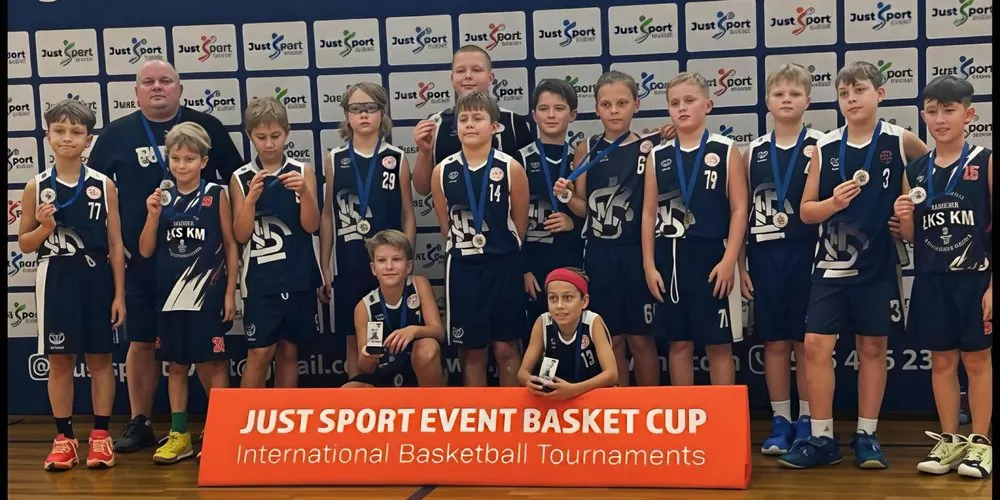

---
search:
  boost: 1.5
title: U11
description: >-
  U11 ŁKS Koszykówka Męska — trener i harmonogram treningów.
---

<nav class="lks-teamswitch" aria-label="Wybierz drużynę">
  <a class="lks-teamswitch__chip" href="../naborowa/">Grupy naborowe</a>
  <a class="lks-teamswitch__chip is-active" href="../u11/" aria-current="page">U11</a>
  <a class="lks-teamswitch__chip" href="../u12/">U12</a>
  <a class="lks-teamswitch__chip" href="../u13/">U13</a>
  <a class="lks-teamswitch__chip" href="../u14/">U14</a>
  <a class="lks-teamswitch__chip" href="../u15/">U15</a>
  <a class="lks-teamswitch__chip" href="../u17/">U17</a>
  <a class="lks-teamswitch__chip" href="../u19/">U19</a>
  <a class="lks-teamswitch__chip" href="../dwa-liga/">2. liga</a>
</nav>

# U11

{ .lks-team-photo width="1000" height="500" }

Pierwsza prawdziwa gra zespołowa. Uczymy podstaw — kozłowania, podania i rzutu — przez zabawę.

Partnerem zespołu jest [Szkoła Gortata](../szkola-gortata.md).

:material-whistle-outline: **Trener prowadzący**
: **Adam Krzysztoń**

:material-account-group-outline: **Wiek zawodników**
: chłopcy urodzeni w 2016 roku i młodsi

## :material-calendar-clock-outline: Harmonogram treningów

| Dzień | Godziny | Hala |
| --- | --- | --- |
| Wtorek | 18:00–19:30 | [Hala Sportowa MOSiR Skorupki](https://maps.app.goo.gl/fvH7jdGYqaDKhrap9){ target=_blank rel="noopener" } ul. ks. Ignacego Skorupki 21 |
| Piątek | 16:30–18:00 | [Hala Sportowa MOSiR Skorupki](https://maps.app.goo.gl/fvH7jdGYqaDKhrap9){ target=_blank rel="noopener" } ul. ks. Ignacego Skorupki 21 |
| Sobota | 9:00–10:30 | [Centrum Sportu PŁ](https://maps.app.goo.gl/jksccTFz8vKv6K8S6){ target=_blank rel="noopener" } Al. Politechniki 11 |

O zmianach w harmonogramie informujemy rodziców i zawodników. Pytania kieruj do [koordynatora organizacyjnego](#kontakt).

## Kontakt i zapisy { #kontakt }

Chcesz dołączyć? Skontaktuj się z koordynatorem organizacyjnym. Umówi
spotkanie z trenerem, który sprawdzi poziom zawodnika.

:material-account-outline: **Koordynator organizacyjny — Maciej&nbsp;Kochaniak**
: zapisy, terminy i sprawy organizacyjne [508 206 918](tel:+48508206918) · [maciej.kochaniak@lkskm.pl](mailto:maciej.kochaniak@lkskm.pl)

:material-account-outline: **Koordynator sportowy — Norbert&nbsp;Kulon**
: sprawy sportowe i szkoleniowe [norbert.kulon@lkskm.pl](mailto:norbert.kulon@lkskm.pl)

:material-phone-outline: **Biuro Klubu**
: [733&nbsp;34&nbsp;**1908**](tel:+48733341908) · [biuro@lkskm.pl](mailto:biuro@lkskm.pl)

