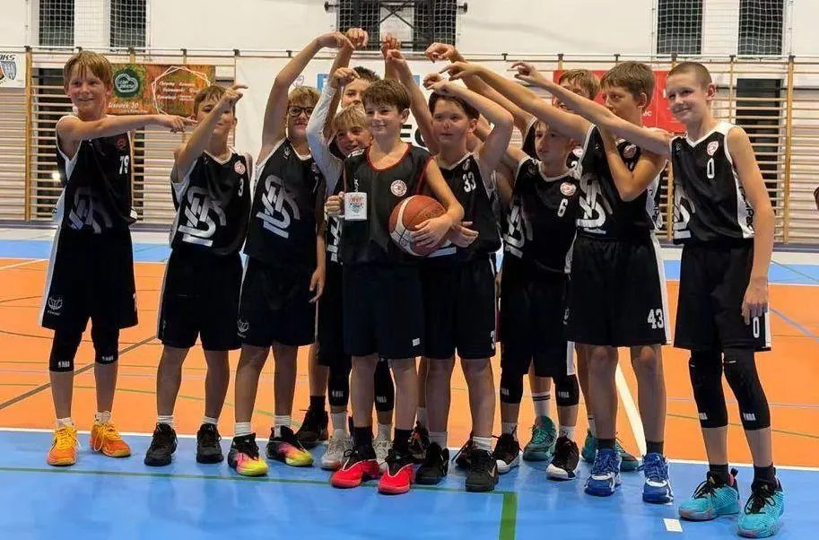
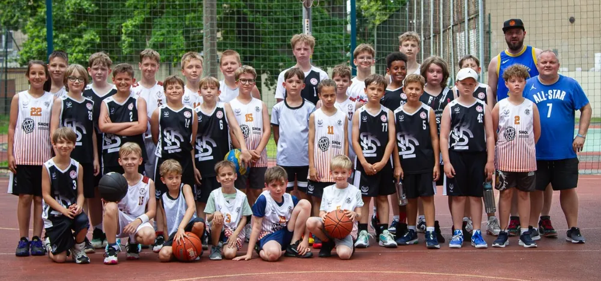

<nav class="lks-teamswitch" aria-label="Wybierz drużynę">
  <a class="lks-teamswitch__chip" href="../naborowa/">Grupy naborowe</a>
  <a class="lks-teamswitch__chip" href="../u11/">U11</a>
  <a class="lks-teamswitch__chip is-active" href="../u12/" aria-current="page">U12</a>
  <a class="lks-teamswitch__chip" href="../u13/">U13</a>
  <a class="lks-teamswitch__chip" href="../u14/">U14</a>
  <a class="lks-teamswitch__chip" href="../u15/">U15</a>
  <a class="lks-teamswitch__chip" href="../u17/">U17</a>
  <a class="lks-teamswitch__chip" href="../u19/">U19</a>
  <a class="lks-teamswitch__chip" href="../dwa-liga/">2. liga</a>
</nav>

# U12

Koordynacja i pierwsza taktyka. Więcej gry, pierwsze turnieje i wyjazdy z drużyną.

W kategorii U12 mamy dwie drużyny: **U12&nbsp;I** oraz **U12&nbsp;II**. Każda ma swojego trenera i harmonogram. Partnerem zespołów jest [Szkoła Gortata](../szkola-gortata.md).

<nav class="lks-subteams" aria-label="Drużyny w kategorii U12">
  <a class="lks-subteams__item" href="#u12-i">
    trener Radosław Darnikowski
    U12 I
  </a>
  <a class="lks-subteams__item" href="#u12-ii">
    trener Wiktor Szewczyk
    U12 II
  </a>
</nav>

## U12 I { #u12-i }

{ .lks-team-photo width="913" height="602" }

:material-whistle-outline: **Trener prowadzący**
: **Radosław Darnikowski**

:material-account-group-outline: **Wiek zawodników**
: chłopcy urodzeni w 2015 roku i młodsi

### :material-calendar-clock-outline: Harmonogram treningów

| Dzień | Godziny | Hala |
| --- | --- | --- |
| Poniedziałek | 16:30–18:00 | [Hala Sportowa MOSiR Karpacka](https://maps.app.goo.gl/73A7gEvEtfSNP7859){ target=_blank rel="noopener" } ul. Karpacka 61 |
| Środa | 16:30–18:00 | [Hala Sportowa MOSiR Karpacka](https://maps.app.goo.gl/73A7gEvEtfSNP7859){ target=_blank rel="noopener" } ul. Karpacka 61 |
| Piątek | 16:30–18:00 | [Hala Sportowa MOSiR Karpacka](https://maps.app.goo.gl/73A7gEvEtfSNP7859){ target=_blank rel="noopener" } ul. Karpacka 61 |

## U12 II { #u12-ii }

{ .lks-team-photo width="1000" height="468" }

:material-whistle-outline: **Trener prowadzący**
: **Wiktor Szewczyk**

:material-account-group-outline: **Wiek zawodników**
: chłopcy urodzeni w 2015 roku i młodsi

### :material-calendar-clock-outline: Harmonogram treningów

| Dzień | Godziny | Hala |
| --- | --- | --- |
| Wtorek | 16:30–18:00 | [Hala Sportowa MOSiR Skorupki](https://maps.app.goo.gl/fvH7jdGYqaDKhrap9){ target=_blank rel="noopener" } ul. ks. Ignacego Skorupki 21 |
| Środa | 19:30–21:00 | [Zatoka Sportu PŁ](https://maps.app.goo.gl/diVwFnzyyFM7oUeJA){ target=_blank rel="noopener" } Al. Politechniki 10 |
| Sobota | 10:30–12:00 | [Hala Sportowa MOSiR Skorupki](https://maps.app.goo.gl/fvH7jdGYqaDKhrap9){ target=_blank rel="noopener" } ul. ks. Ignacego Skorupki 21 |

O zmianach w harmonogramie informujemy rodziców i zawodników. Pytania kieruj do [koordynatora organizacyjnego](#kontakt).

## Kontakt i zapisy { #kontakt }

Chcesz dołączyć? Skontaktuj się z koordynatorem organizacyjnym. Umówi
spotkanie z trenerem, który sprawdzi poziom zawodnika.

:material-account-outline: **Koordynator organizacyjny — Maciej&nbsp;Kochaniak**
: zapisy, terminy i sprawy organizacyjne [508 206 918](tel:+48508206918) · [maciej.kochaniak@lkskm.pl](mailto:maciej.kochaniak@lkskm.pl)

:material-account-outline: **Koordynator sportowy — Norbert&nbsp;Kulon**
: sprawy sportowe i szkoleniowe [norbert.kulon@lkskm.pl](mailto:norbert.kulon@lkskm.pl)

:material-phone-outline: **Biuro Klubu**
: [733&nbsp;34&nbsp;**1908**](tel:+48733341908) · [biuro@lkskm.pl](mailto:biuro@lkskm.pl)

