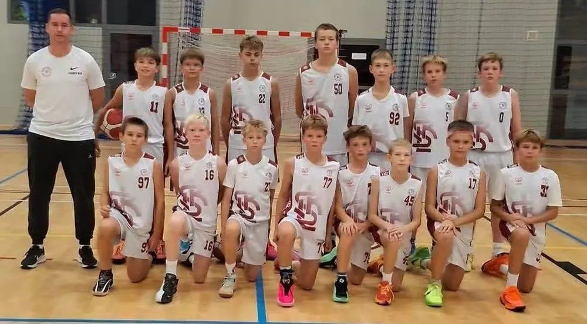
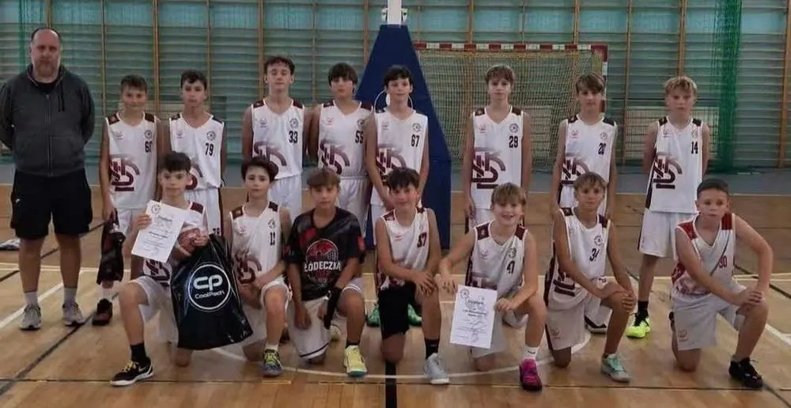

<nav class="lks-teamswitch" aria-label="Wybierz drużynę">
  <a class="lks-teamswitch__chip" href="../naborowa/">Grupy naborowe</a>
  <a class="lks-teamswitch__chip" href="../u11/">U11</a>
  <a class="lks-teamswitch__chip" href="../u12/">U12</a>
  <a class="lks-teamswitch__chip is-active" href="../u13/" aria-current="page">U13</a>
  <a class="lks-teamswitch__chip" href="../u14/">U14</a>
  <a class="lks-teamswitch__chip" href="../u15/">U15</a>
  <a class="lks-teamswitch__chip" href="../u17/">U17</a>
  <a class="lks-teamswitch__chip" href="../u19/">U19</a>
  <a class="lks-teamswitch__chip" href="../dwa-liga/">2. liga</a>
</nav>

# U13

Regularne mecze ligowe i turnieje. Trening coraz bardziej dopasowany do pozycji na boisku.

W kategorii U13 mamy dwie drużyny: **U13&nbsp;I** oraz **U13&nbsp;II**. Każda ma swojego trenera i harmonogram. Partnerem zespołów jest [Szkoła Gortata](../szkola-gortata.md).

<nav class="lks-subteams" aria-label="Drużyny w kategorii U13">
  <a class="lks-subteams__item" href="#u13-i">
    trener Maciej Kochaniak
    U13 I
  </a>
  <a class="lks-subteams__item" href="#u13-ii">
    trener Marcin Markowicz
    U13 II
  </a>
</nav>

## U13 I { #u13-i }

{ .lks-team-photo width="1000" height="553" }

:material-whistle-outline: **Trener prowadzący**
: **Maciej Kochaniak**

:material-account-group-outline: **Wiek zawodników**
: chłopcy urodzeni w 2014 roku i młodsi

:material-dumbbell: **Przygotowanie motoryczne**
: Aleksander Fabiszewski (treningi na siłowni)

### :material-calendar-clock-outline: Harmonogram treningów

| Dzień | Godziny | Hala |
| --- | --- | --- |
| Poniedziałek | 18:00–19:30 | [Hala Sportowa MOSiR Karpacka](https://maps.app.goo.gl/73A7gEvEtfSNP7859){ target=_blank rel="noopener" } ul. Karpacka 61 |
| Wtorek | 18:00–19:30 trening motoryczny | [Zatoka Sportu PŁ](https://maps.app.goo.gl/diVwFnzyyFM7oUeJA){ target=_blank rel="noopener" } Al. Politechniki 10 |
| Czwartek | 16:30–18:00 | [Hala Sportowa MOSiR Karpacka](https://maps.app.goo.gl/73A7gEvEtfSNP7859){ target=_blank rel="noopener" } ul. Karpacka 61 |
| Piątek | 16:30–18:00 | [Zatoka Sportu PŁ](https://maps.app.goo.gl/diVwFnzyyFM7oUeJA){ target=_blank rel="noopener" } Al. Politechniki 10 |

## U13 II { #u13-ii }

{ .lks-team-photo width="1000" height="516" }

:material-whistle-outline: **Trener prowadzący**
: **Marcin Markowicz**

:material-account-group-outline: **Wiek zawodników**
: chłopcy urodzeni w 2014 roku i młodsi

:material-dumbbell: **Przygotowanie motoryczne**
: Aleksander Fabiszewski (treningi na siłowni)

### :material-calendar-clock-outline: Harmonogram treningów

| Dzień | Godziny | Hala |
| --- | --- | --- |
| Poniedziałek | 16:30–18:00 | [Zatoka Sportu PŁ](https://maps.app.goo.gl/diVwFnzyyFM7oUeJA){ target=_blank rel="noopener" } Al. Politechniki 10 |
| Wtorek | 16:30–18:00 trening motoryczny | [Zatoka Sportu PŁ](https://maps.app.goo.gl/diVwFnzyyFM7oUeJA){ target=_blank rel="noopener" } Al. Politechniki 10 |
| Środa | 16:30–18:00 | [Zatoka Sportu PŁ](https://maps.app.goo.gl/diVwFnzyyFM7oUeJA){ target=_blank rel="noopener" } Al. Politechniki 10 |
| Piątek | 18:00–19:30 | [Hala Sportowa MOSiR Karpacka](https://maps.app.goo.gl/73A7gEvEtfSNP7859){ target=_blank rel="noopener" } ul. Karpacka 61 |

O zmianach w harmonogramie informujemy rodziców i zawodników. Pytania kieruj do [koordynatora organizacyjnego](#kontakt).

## Kontakt i zapisy { #kontakt }

Chcesz dołączyć? Skontaktuj się z koordynatorem organizacyjnym. Umówi
spotkanie z trenerem, który sprawdzi poziom zawodnika.

:material-account-outline: **Koordynator organizacyjny — Maciej&nbsp;Kochaniak**
: zapisy, terminy i sprawy organizacyjne [508 206 918](tel:+48508206918) · [maciej.kochaniak@lkskm.pl](mailto:maciej.kochaniak@lkskm.pl)

:material-account-outline: **Koordynator sportowy — Norbert&nbsp;Kulon**
: sprawy sportowe i szkoleniowe [norbert.kulon@lkskm.pl](mailto:norbert.kulon@lkskm.pl)

:material-phone-outline: **Biuro Klubu**
: [733&nbsp;34&nbsp;**1908**](tel:+48733341908) · [biuro@lkskm.pl](mailto:biuro@lkskm.pl)

