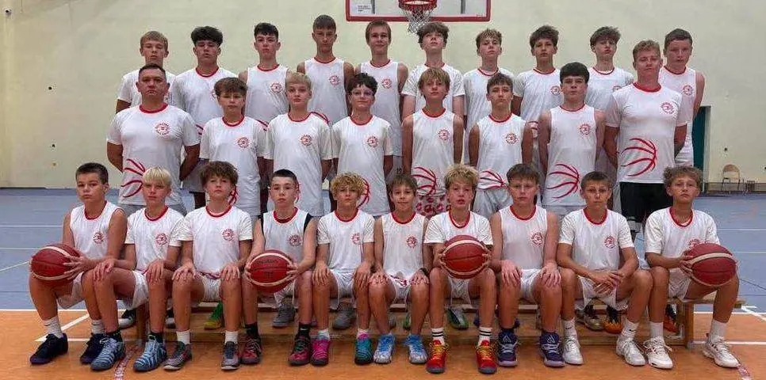

<nav class="lks-teamswitch" aria-label="Wybierz drużynę">
  <a class="lks-teamswitch__chip" href="../naborowa/">Grupy naborowe</a>
  <a class="lks-teamswitch__chip" href="../u11/">U11</a>
  <a class="lks-teamswitch__chip" href="../u12/">U12</a>
  <a class="lks-teamswitch__chip" href="../u13/">U13</a>
  <a class="lks-teamswitch__chip is-active" href="../u14/" aria-current="page">U14</a>
  <a class="lks-teamswitch__chip" href="../u15/">U15</a>
  <a class="lks-teamswitch__chip" href="../u17/">U17</a>
  <a class="lks-teamswitch__chip" href="../u19/">U19</a>
  <a class="lks-teamswitch__chip" href="../dwa-liga/">2. liga</a>
</nav>

# U14

{ .lks-team-photo width="966" height="480" }

Większe obciążenia treningowe, praca nad siłą i zaawansowaną taktyką zespołową.

Partnerem zespołu jest [Szkoła Gortata](../szkola-gortata.md).

:material-whistle-outline: **Trener prowadzący**
: **Maciej Rudziński**

:material-account-group-outline: **Wiek zawodników**
: chłopcy urodzeni w 2013 roku i młodsi

:material-trophy-outline: **Rozgrywki**
: liga województwa łódzkiego — drużyna gra także w kategorii U15

:material-dumbbell: **Przygotowanie motoryczne**
: Aleksander Fabiszewski (treningi na siłowni)

## :material-calendar-clock-outline: Harmonogram treningów

| Dzień | Godziny | Hala |
| --- | --- | --- |
| Poniedziałek | 16:30–18:00 | [Zatoka Sportu PŁ](https://maps.app.goo.gl/diVwFnzyyFM7oUeJA){ target=_blank rel="noopener" } Al. Politechniki 10 |
| Wtorek | 16:30–18:00 | [Hala Sportowa MOSiR Karpacka](https://maps.app.goo.gl/73A7gEvEtfSNP7859){ target=_blank rel="noopener" } ul. Karpacka 61 |
| Środa | 16:30–18:00 trening motoryczny | [Zatoka Sportu PŁ](https://maps.app.goo.gl/diVwFnzyyFM7oUeJA){ target=_blank rel="noopener" } Al. Politechniki 10 |
| Czwartek | 16:30–18:00 | [Zatoka Sportu PŁ](https://maps.app.goo.gl/diVwFnzyyFM7oUeJA){ target=_blank rel="noopener" } Al. Politechniki 10 |

O zmianach w harmonogramie informujemy rodziców i zawodników. Pytania kieruj do [koordynatora organizacyjnego](#kontakt).

## Kontakt i zapisy { #kontakt }

Chcesz dołączyć? Skontaktuj się z koordynatorem organizacyjnym. Umówi
spotkanie z trenerem, który sprawdzi poziom zawodnika.

:material-account-outline: **Koordynator organizacyjny — Maciej&nbsp;Kochaniak**
: zapisy, terminy i sprawy organizacyjne [508 206 918](tel:+48508206918) · [maciej.kochaniak@lkskm.pl](mailto:maciej.kochaniak@lkskm.pl)

:material-account-outline: **Koordynator sportowy — Norbert&nbsp;Kulon**
: sprawy sportowe i szkoleniowe [norbert.kulon@lkskm.pl](mailto:norbert.kulon@lkskm.pl)

:material-phone-outline: **Biuro Klubu**
: [733&nbsp;34&nbsp;**1908**](tel:+48733341908) · [biuro@lkskm.pl](mailto:biuro@lkskm.pl)

