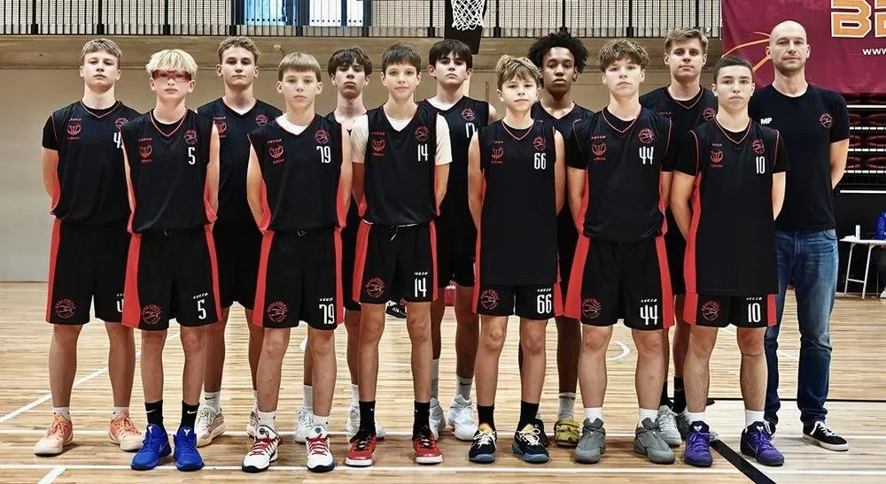
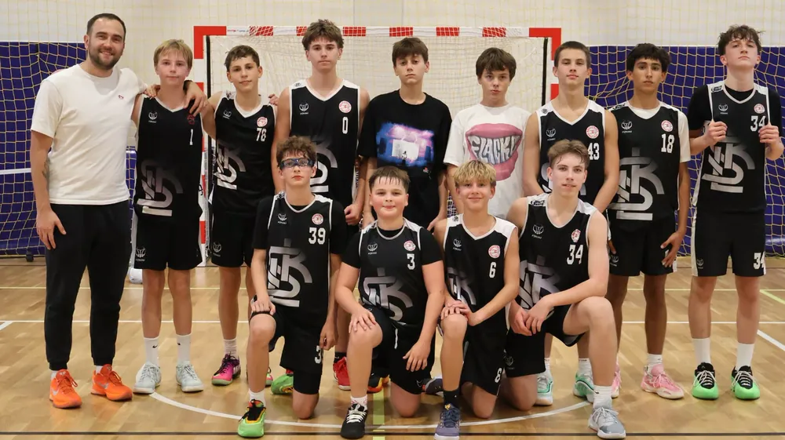

---
search:
  boost: 1.5
title: U15
description: >-
  U15 ŁKS Koszykówka Męska — dwie drużyny: U15 I (trener Maciej Puczyński) i
  U15 II (trener Bartłomiej Frątczak). Trenerzy i harmonogramy treningów.
---

<nav class="lks-teamswitch" aria-label="Wybierz drużynę">
  <a class="lks-teamswitch__chip" href="../naborowa/">Grupy naborowe</a>
  <a class="lks-teamswitch__chip" href="../u11/">U11</a>
  <a class="lks-teamswitch__chip" href="../u12/">U12</a>
  <a class="lks-teamswitch__chip" href="../u13/">U13</a>
  <a class="lks-teamswitch__chip" href="../u14/">U14</a>
  <a class="lks-teamswitch__chip is-active" href="../u15/" aria-current="page">U15</a>
  <a class="lks-teamswitch__chip" href="../u17/">U17</a>
  <a class="lks-teamswitch__chip" href="../u19/">U19</a>
  <a class="lks-teamswitch__chip" href="../dwa-liga/">2. liga</a>
</nav>

# U15

Pełny sezon ligowy i turnieje. Coraz więcej pracy nad nastawieniem psychicznym i przygotowaniem do rywalizacji.

W kategorii U15 mamy dwie drużyny: **U15&nbsp;I** oraz **U15&nbsp;II**. Każda ma swojego trenera i harmonogram. Partnerem zespołów jest [Szkoła Gortata](../szkola-gortata.md).

<nav class="lks-subteams" aria-label="Drużyny w kategorii U15">
  <a class="lks-subteams__item" href="#u15-i">
    trener Maciej Puczyński
    U15 I
  </a>
  <a class="lks-subteams__item" href="#u15-ii">
    trener Bartłomiej Frątczak
    U15 II
  </a>
</nav>

## U15 I { #u15-i }

{ .lks-team-photo width="1000" height="547" }

:material-whistle-outline: **Trener prowadzący**
: **Maciej Puczyński**

:material-account-group-outline: **Wiek zawodników**
: chłopcy urodzeni w 2012 roku i młodsi

:material-trophy-outline: **Rozgrywki**
: liga województwa łódzkiego — drużyna gra także w kategorii U17

:material-dumbbell: **Przygotowanie motoryczne**
: Aleksander Fabiszewski (treningi na siłowni)

### :material-calendar-clock-outline: Harmonogram treningów

| Dzień | Godziny | Hala |
| --- | --- | --- |
| Poniedziałek | 14:00–16:00 trening motoryczny | [Hala Sportowa MOSiR Skorupki](https://maps.app.goo.gl/fvH7jdGYqaDKhrap9){ target=_blank rel="noopener" } ul. ks. Ignacego Skorupki 21 |
| Wtorek | 16:30–18:00 | [Zatoka Sportu PŁ](https://maps.app.goo.gl/diVwFnzyyFM7oUeJA){ target=_blank rel="noopener" } Al. Politechniki 10 |
| Środa | 14:00–16:00 trening motoryczny | [Hala Sportowa MOSiR Skorupki](https://maps.app.goo.gl/fvH7jdGYqaDKhrap9){ target=_blank rel="noopener" } ul. ks. Ignacego Skorupki 21 |
| Czwartek | 16:30–18:00 | [Zatoka Sportu PŁ](https://maps.app.goo.gl/diVwFnzyyFM7oUeJA){ target=_blank rel="noopener" } Al. Politechniki 10 |
| Piątek | 18:00–19:30 | [Zatoka Sportu PŁ](https://maps.app.goo.gl/diVwFnzyyFM7oUeJA){ target=_blank rel="noopener" } Al. Politechniki 10 |

## U15 II { #u15-ii }

{ .lks-team-photo width="1000" height="561" }

:material-whistle-outline: **Trener prowadzący**
: **Bartłomiej Frątczak**

:material-account-group-outline: **Wiek zawodników**
: chłopcy urodzeni w 2012 roku i młodsi

:material-dumbbell: **Przygotowanie motoryczne**
: Aleksander Fabiszewski (treningi na siłowni)

### :material-calendar-clock-outline: Harmonogram treningów

| Dzień | Godziny | Hala |
| --- | --- | --- |
| Wtorek | 19:30–21:00 | [Hala Sportowa MOSiR Skorupki](https://maps.app.goo.gl/fvH7jdGYqaDKhrap9){ target=_blank rel="noopener" } ul. ks. Ignacego Skorupki 21 |
| Środa | 18:00–19:30 trening motoryczny | [Zatoka Sportu PŁ](https://maps.app.goo.gl/diVwFnzyyFM7oUeJA){ target=_blank rel="noopener" } Al. Politechniki 10 |
| Czwartek | 18:00–19:30 | [Zatoka Sportu PŁ](https://maps.app.goo.gl/diVwFnzyyFM7oUeJA){ target=_blank rel="noopener" } Al. Politechniki 10 |
| Piątek | 16:30–18:00 | [Zatoka Sportu PŁ](https://maps.app.goo.gl/diVwFnzyyFM7oUeJA){ target=_blank rel="noopener" } Al. Politechniki 10 |

O zmianach w harmonogramie informujemy rodziców i zawodników. Pytania kieruj do [koordynatora organizacyjnego](#kontakt).

## Kontakt i zapisy { #kontakt }

Chcesz dołączyć? Skontaktuj się z koordynatorem organizacyjnym. Umówi
spotkanie z trenerem, który sprawdzi poziom zawodnika.

:material-account-outline: **Koordynator organizacyjny — Maciej&nbsp;Kochaniak**
: zapisy, terminy i sprawy organizacyjne [508 206 918](tel:+48508206918) · [maciej.kochaniak@lkskm.pl](mailto:maciej.kochaniak@lkskm.pl)

:material-account-outline: **Koordynator sportowy — Norbert&nbsp;Kulon**
: sprawy sportowe i szkoleniowe [norbert.kulon@lkskm.pl](mailto:norbert.kulon@lkskm.pl)

:material-phone-outline: **Biuro Klubu**
: [733&nbsp;34&nbsp;**1908**](tel:+48733341908) · [biuro@lkskm.pl](mailto:biuro@lkskm.pl)

