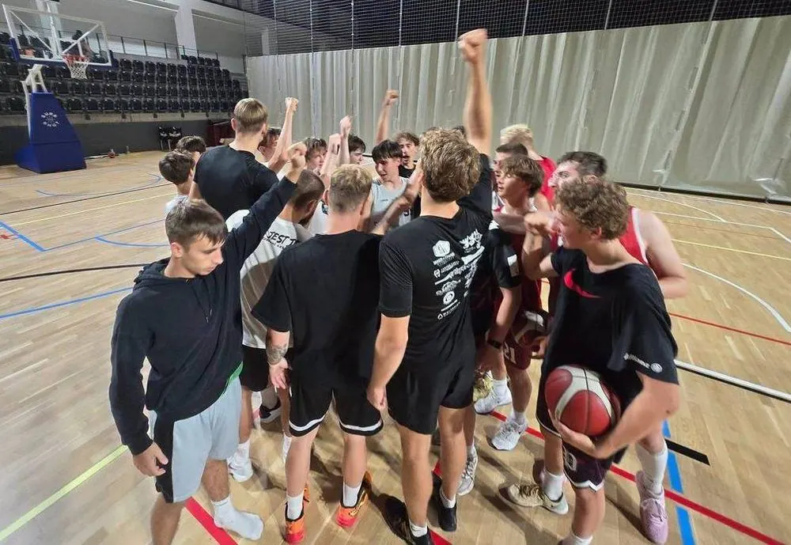

<nav class="lks-teamswitch" aria-label="Wybierz drużynę">
  <a class="lks-teamswitch__chip" href="../naborowa/">Grupy naborowe</a>
  <a class="lks-teamswitch__chip" href="../u11/">U11</a>
  <a class="lks-teamswitch__chip" href="../u12/">U12</a>
  <a class="lks-teamswitch__chip" href="../u13/">U13</a>
  <a class="lks-teamswitch__chip" href="../u14/">U14</a>
  <a class="lks-teamswitch__chip" href="../u15/">U15</a>
  <a class="lks-teamswitch__chip" href="../u17/">U17</a>
  <a class="lks-teamswitch__chip is-active" href="../u19/" aria-current="page">U19</a>
  <a class="lks-teamswitch__chip" href="../dwa-liga/">2. liga</a>
</nav>

# U19

{ .lks-team-photo width="1000" height="689" }

Najwyższy poziom młodzieżowy. Bezpośrednie przygotowanie do gry w zespole seniorskim.

Sponsorem zespołu jest [CoolPack](https://e-sklep.coolpack.com.pl/){ target=_blank rel="noopener" }, a partnerem — [Politechnika Łódzka](https://www.p.lodz.pl/){ target=_blank rel="noopener" }.

:material-whistle-outline: **Trener prowadzący**
: **Piotr Trepka**

:material-account-group-outline: **Wiek zawodników**
: chłopcy urodzeni w 2008 roku i młodsi

:material-dumbbell: **Przygotowanie motoryczne**
: Aleksander Fabiszewski (treningi na siłowni)

## :material-calendar-clock-outline: Harmonogram treningów

| Dzień | Godziny | Hala |
| --- | --- | --- |
| Poniedziałek | 19:30–21:00 | [Hala Sportowa MOSiR Skorupki](https://maps.app.goo.gl/fvH7jdGYqaDKhrap9){ target=_blank rel="noopener" } ul. ks. Ignacego Skorupki 21 |
| Wtorek | 19:30–21:00 | [Zatoka Sportu PŁ](https://maps.app.goo.gl/diVwFnzyyFM7oUeJA){ target=_blank rel="noopener" } Al. Politechniki 10 |
| Środa | 20:00–21:30 | [Zatoka Sportu PŁ](https://maps.app.goo.gl/diVwFnzyyFM7oUeJA){ target=_blank rel="noopener" } Al. Politechniki 10 |
| Czwartek | 19:30–21:30 | [Hala Sportowa MOSiR Skorupki](https://maps.app.goo.gl/fvH7jdGYqaDKhrap9){ target=_blank rel="noopener" } ul. ks. Ignacego Skorupki 21 |
| Piątek | 20:00–21:30 | [Zatoka Sportu PŁ](https://maps.app.goo.gl/diVwFnzyyFM7oUeJA){ target=_blank rel="noopener" } Al. Politechniki 10 |

O zmianach w harmonogramie informujemy rodziców i zawodników. Pytania kieruj do [koordynatora organizacyjnego](#kontakt).

## Kontakt i zapisy { #kontakt }

Chcesz dołączyć? Skontaktuj się z koordynatorem organizacyjnym. Umówi
spotkanie z trenerem, który sprawdzi poziom zawodnika.

:material-account-outline: **Koordynator organizacyjny — Maciej&nbsp;Kochaniak**
: zapisy, terminy i sprawy organizacyjne [508 206 918](tel:+48508206918) · [maciej.kochaniak@lkskm.pl](mailto:maciej.kochaniak@lkskm.pl)

:material-account-outline: **Koordynator sportowy — Norbert&nbsp;Kulon**
: sprawy sportowe i szkoleniowe [norbert.kulon@lkskm.pl](mailto:norbert.kulon@lkskm.pl)

:material-phone-outline: **Biuro Klubu**
: [733&nbsp;34&nbsp;**1908**](tel:+48733341908) · [biuro@lkskm.pl](mailto:biuro@lkskm.pl)

