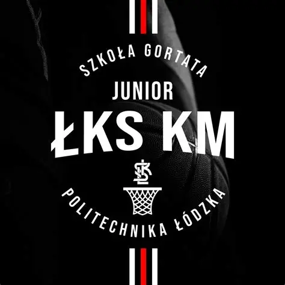

---
hide:
  - navigation
  - toc
---

<!-- ═══════════════════════════════════════════════════════ -->
<!--  HERO                                                   -->
<!-- ═══════════════════════════════════════════════════════ -->

  
  
Graj. Rozwijaj się. Wygrywaj.

  
Łódzki Klub Sportowy Basket — Łódź

  

    <a href="dolacz/" class="btn-primary">Dołącz do nas</a>
    <a href="kontakt/" class="btn-secondary">Kontakt</a>
  

<!-- ═══════════════════════════════════════════════════════ -->
<!--  STATYSTYKI                                             -->
<!-- ═══════════════════════════════════════════════════════ -->

  

    
120+

    
Zawodników

  

  

    
12

    
Drużyn

  

  

    
15+

    
Lat działalności

  

  

    
40+

    
Turniejów w sezonie

  

<!-- ═══════════════════════════════════════════════════════ -->
<!--  KAFELKI NAWIGACYJNE                                    -->
<!-- ═══════════════════════════════════════════════════════ -->

Co chcesz sprawdzić?

  <a href="o-klubie/" class="tile">
    
🏛️

    
O klubie

    
Historia, misja i wartości ŁKS Basket Łódź.

    
Dowiedz się więcej →

  </a>
  <a href="trenerzy/" class="tile">
    
👨‍🏫

    
Trenerzy

    
Poznaj naszą kadrę szkoleniową z licencjami PZKosz.

    
Poznaj trenerów →

  </a>
  <a href="harmonogram/" class="tile">
    
📅

    
Harmonogram

    
Plany treningów dla wszystkich drużyn — U11 do U19.

    
Zobacz harmonogram →

  </a>
  <a href="turnieje/" class="tile">
    
🏆

    
Turnieje

    
Kalendarz turniejów i rozgrywek ligowych w sezonie.

    
Zobacz kalendarz →

  </a>
  <a href="dolacz/" class="tile">
    
🏀

    
Dołącz do nas

    
Pierwsze zajęcia bezpłatne. Sprawdź jak zacząć.

    
Dołącz teraz →

  </a>
  <a href="sponsor/" class="tile">
    
🤝

    
Sponsoring

    
Wspieraj lokalny sport i buduj markę w Łodzi.

    
Zostań sponsorem →

  </a>
  <a href="kontakt/" class="tile">
    
📬

    
Kontakt

    
Napisz lub zadzwoń — odpowiadamy w 24 godziny.

    
Skontaktuj się →

  </a>

<!-- ═══════════════════════════════════════════════════════ -->
<!--  CTA                                                    -->
<!-- ═══════════════════════════════════════════════════════ -->

  <h2>Gotowy na pierwszy trening?</h2>
  
Przyjdź, sprawdź nas i przekonaj się sam. Pierwsze zajęcia są całkowicie bezpłatne.

  <a href="dolacz/">Zapisz się na trening próbny</a>

