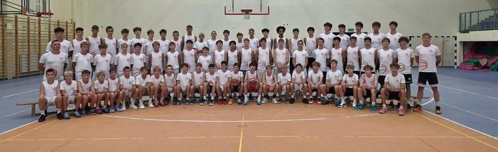

# Nasz Klub

{ .lks-team-photo .lks-team-photo--wide }

Stowarzyszenie ŁKS Koszykówka Męska prowadzi drużyny chłopców od grup
naborowych (rocznik 2017 i młodsi), przez U11–U19, po zespół seniorski w 2. lidze.
Kto przyjdzie do nas jako dziecko, może grać w jednym Klubie aż do koszykówki
seniorskiej.

## :material-target: Po co to robimy

### :material-basketball: Misja
Uczymy dobrej koszykówki, a przy okazji pracy w zespole,
odpowiedzialności i wiary w siebie.

### :material-telescope: Wizja
Chcemy być pierwszym wyborem rodzin z województwa łódzkiego, które szukają
dobrego i przyjaznego klubu koszykówki.

### :material-hand-heart-outline: Wartości
**Szacunek** · **Zaangażowanie** · **Zespół** · **Rozwój**. Drużyna jest
ważniejsza niż jednostka, a codzienna praca — ważniejsza niż talent.

## :material-flag-outline: ŁKS od 1908 roku

Łódzki Klub Sportowy powstał w 1908 roku i do dziś ma wiele sekcji, m.in. piłki nożnej, siatkówki oraz koszykówki męskiej i żeńskiej. Stowarzyszenie ŁKS
Koszykówka Męska rozwija męską koszykówkę w tych barwach. Rok założenia ŁKS
znajdziesz też w numerze telefonu naszego biura: 733&nbsp;34&nbsp;**1908**.

## :material-trophy-variant-outline: ŁKS CoolPack Łódź — 1. liga

Seniorska drużyna **ŁKS CoolPack Łódź** walczy w 1. lidze o awans do PGE Basket Ligi, czyli ekstraklasy. Wspieramy seniorów i kibicujemy im. Wierzymy, że nasi młodzieżowcy będą kiedyś walczyć na parkietach ekstraklasy w barwach ŁKS CoolPack Łódź. [Więcej o drużynie](lks-coolpack.md)

## :material-whistle-outline: Kadra trenerska

Każdą drużynę i grupę naborową prowadzi jeden trener. Sprawy drużyn i zapisy obsługują
koordynatorzy — ich kontakty znajdziesz w zakładce [Kontakt](kontakt.md).

| Drużyna | Trener prowadzący |
|---------|-------------------|
| Grupy naborowe, SP nr 19 | Łukasz Ławniczak |
| Grupy naborowe, SP nr 41 | Adam Krzysztoń |
| Grupy naborowe, SP nr 48 | Maciej Lesner |
| Grupy naborowe, SP nr 199 | Radosław Darnikowski |
| U11 | Adam Krzysztoń |
| U12 I | Radosław Darnikowski |
| U12 II | Wiktor Szewczyk |
| U13 I | Maciej Kochaniak |
| U13 II | Marcin Markowicz |
| U14 | Maciej Rudziński |
| U15 I | Maciej Puczyński |
| U15 II | Bartłomiej Frątczak |
| U17 | Patryk Dembowski |
| U19 | Piotr Trepka |
| ŁKS Politechnika Łódzka (2. liga) | Piotr Trepka |

| Trener motoryczny | Zakres |
|-------------------|--------|
| Aleksander Fabiszewski | Praca na siłowni nad rozwojem motorycznym zawodników |

| Koordynator | Zakres |
|-------------|--------|
| Szczepan Prasol | grupy naborowe i zapisy do nich |
| Maciej Kochaniak | sprawy organizacyjne i zapisy do drużyn U11–U19 |
| Norbert Kulon | sprawy sportowe i szkoleniowe |

## :material-school-outline: Szkoła i Klub

Szkoła Mistrzostwa Sportowego Marcina Gortata w Łodzi jest partnerem naszych drużyn U11–U17. To szkoła podstawowa i liceum, ale grać u nas może każdy — nie trzeba być jej uczniem. Uczeń, który jest też zawodnikiem, zyskuje więcej treningów i plan
lekcji dopasowany do treningów. Więcej w zakładce
[ŁKS x Szkoła Gortata](szkola-gortata.md).

## :material-domain: Politechnika Łódzka

Od wielu sezonów naszym partnerem jest Politechnika Łódzka. Dzięki tej współpracy nasz zespół
seniorski gra w 2. lidze jako **ŁKS Politechnika Łódzka**. Młodzi zawodnicy
mają jasny cel: grę w seniorach w tych samych barwach. Pokazujemy też, że sport
i studia mogą iść w parze. Więcej na stronie
[drużyny seniorskiej](druzyny/dwa-liga.md).

[Zobacz nasze drużyny](druzyny/index.md){ .md-button .md-button--primary }
[Zapytaj o zapisy](dolacz.md){ .md-button }
