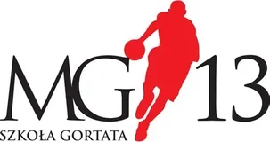
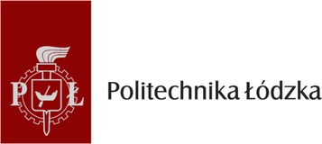

---
search:
  boost: 1.5
title: Sponsorzy
description: >-
  Zostań sponsorem ŁKS Koszykówka Męska: 15 drużyn, pełna piramida
  szkoleniowa i wizerunek marki, której zależy na lokalnej społeczności.
---

# Zostań sponsorem

## Zbuduj wizerunek marki, której zależy na lokalnej społeczności

Sponsoring ŁKS Koszykówka Męska to inwestycja w młodych ludzi i w wizerunek
Twojej firmy. Mamy 15 drużyn — od grup naborowych w czterech szkołach
podstawowych po zespół seniorski w 2. lidze. To około 200 zawodników z Łodzi
i okolic, a z nimi ich rodziny i przyjaciele.

Możesz wesprzeć jedną drużynę, grupę naborową w wybranej szkole albo cały Klub.

[Porozmawiajmy o współpracy](#kontakt-dla-firm){ .md-button .md-button--primary }

---

## Dlaczego warto?

- :material-star-outline: **Wizerunek marki, której zależy na lokalnej społeczności** — wspierasz młodych łodzian i ich rodziny, a to buduje zaufanie do Twojej firmy.
- :material-map-marker-radius-outline: **Zasięg lokalny** — Twoje logo tam, gdzie mieszkają i kibicują Twoi klienci.
- :material-account-group-outline: **Dotarcie do rodzin** — rodzice i bliscy zawodników to naturalni odbiorcy.
- :material-forum-outline: **Obecność w social mediach** — oznaczamy sponsora w relacjach z treningów, meczów i turniejów.

---

## Kto już z nami gra

**CoolPack** to strategiczny sponsor całego Klubu. Naszymi partnerami są **Szkoła Gortata** (drużyny U11–U17) i **Politechnika Łódzka** (drużyna U19 i zespół 2. ligi).

-   { .lks-partner-logo .lks-partner-logo--wide .no-lightbox width="721" height="96" loading="lazy" }

    ### :material-handshake-outline: CoolPack

    **Strategiczny sponsor Klubu.** Marka plecaków, która gra razem z nami.

    [:material-open-in-new: Sklep CoolPack](https://e-sklep.coolpack.com.pl/){ target=_blank rel="noopener" }

-   { .lks-partner-logo .no-lightbox width="303" height="160" loading="lazy" }

    ### :material-handshake-outline: Szkoła Gortata

    **Partner drużyn U11–U17.** Szkoła Mistrzostwa Sportowego Marcina
    Gortata w Łodzi.

    [:material-open-in-new: szkolagortata.pl](https://szkolagortata.pl/){ target=_blank rel="noopener" }

-   { .lks-partner-logo .no-lightbox width="357" height="160" loading="lazy" }

    ### :material-domain: Politechnika Łódzka

    **Partner U19 i 2. ligi.** Jedna z największych łódzkich uczelni.
    Nasz zespół seniorski gra jako ŁKS Politechnika Łódzka.

    [:material-open-in-new: p.lodz.pl](https://www.p.lodz.pl/){ target=_blank rel="noopener" }

Dzięki sponsorowi i partnerom możemy planować rozwój drużyn na lata. **Dołącz do nich** —
grupy naborowe i inne drużyny czekają na swoich sponsorów.

[Zostań sponsorem](#kontakt-dla-firm){ .md-button .md-button--primary }

---

## Kontakt dla firm { #kontakt-dla-firm }

Jeśli Twoja firma jest zainteresowana współpracą z naszym Klubem, zapraszamy
do kontaktu. Napisz lub zadzwoń — porozmawiamy o Twoich oczekiwaniach i razem
ustalimy najkorzystniejszą dla obydwu stron formę współpracy.

:material-phone-outline: **Telefon**
: [733&nbsp;34&nbsp;**1908**](tel:+48733341908)

:material-email-outline: **E-mail**
: [biuro@lkskm.pl](mailto:biuro@lkskm.pl)

:material-map-marker-outline: **Biuro Klubu**
: [Al. Unii Lubelskiej 2, 94-020 Łódź](https://www.google.com/maps/search/?api=1&query=Al.+Unii+Lubelskiej+2,+94-020+%C5%81%C3%B3d%C5%BA), II&nbsp;piętro

