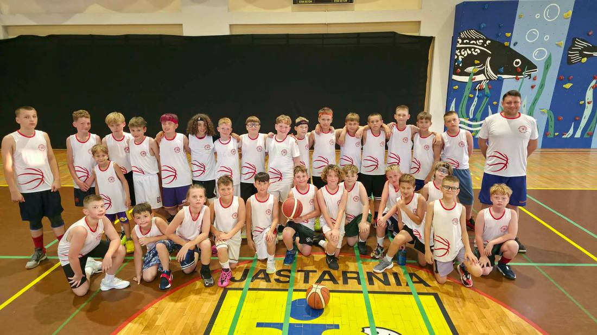
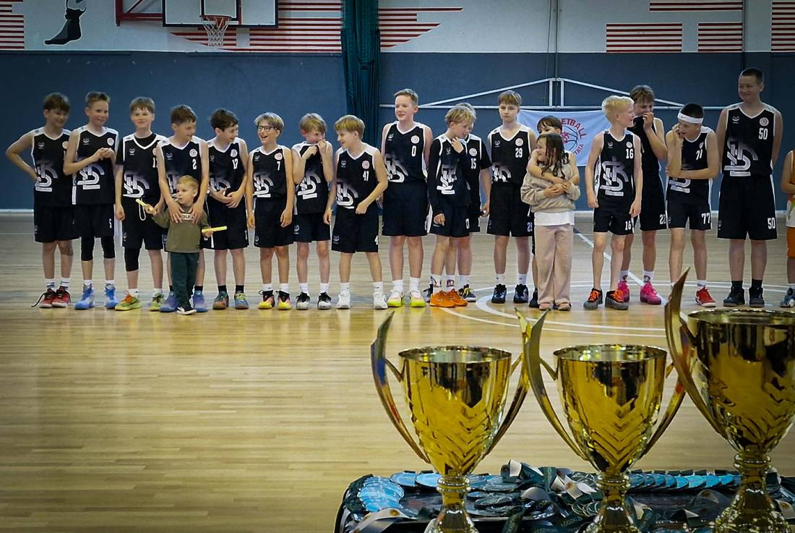
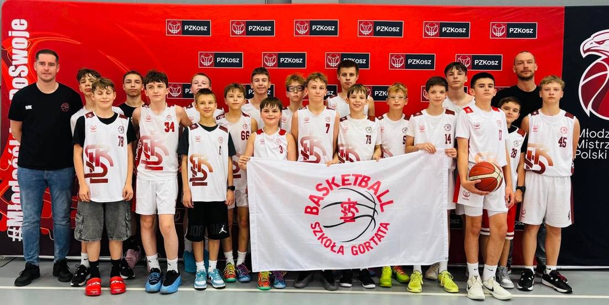
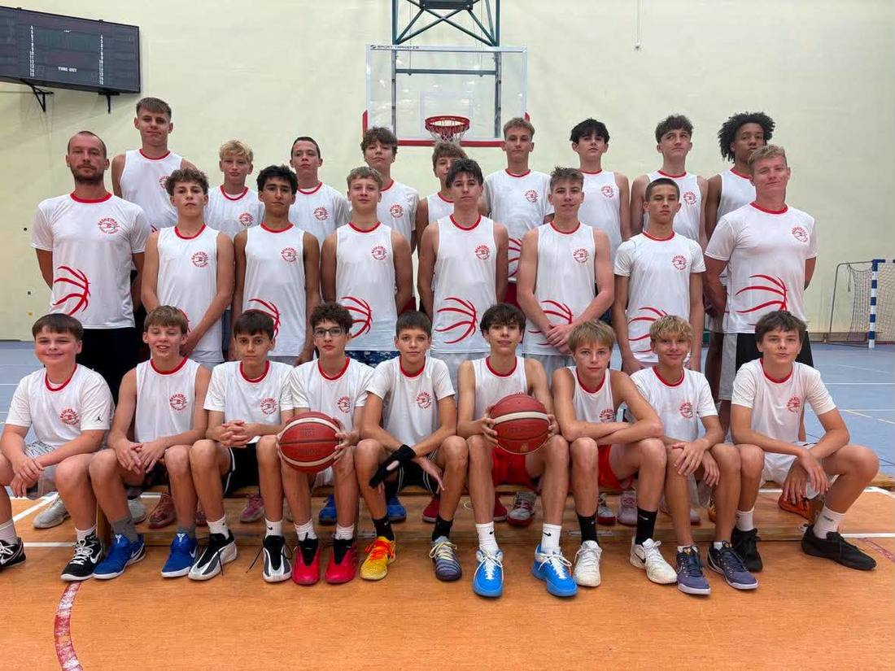
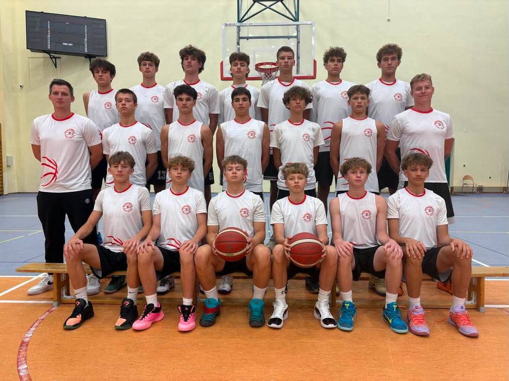

# Strefa dla rodzica

Wybierz grupę swojego dziecka. Na jej stronie znajdziesz komplet informacji:
harmonogram treningów, kontakt do trenera prowadzącego, obozy i wyjazdy,
najbliższe turnieje oraz aktualności dotyczące tej konkretnej drużyny.

<a class="lks-group" href="u11/">
  
  U11
  Adam Krzysztoń
  ok. 10–11 lat
</a>

<a class="lks-group" href="u12/">
  
  U12
  Radosław Darnikowski
  ok. 11–12 lat
</a>

<a class="lks-group" href="u13/">
  
  U13
  Maciej Kochaniak
  ok. 12–13 lat
</a>

<a class="lks-group" href="u14/">
  
  U14
  Maciej Rudziński
  ok. 13–14 lat
</a>

<a class="lks-group" href="u15/">
  
  U15
  Maciej Puczyński
  ok. 14–15 lat
</a>

<a class="lks-group" href="u17/">
  
  U17
  Patryk Dembowski
  ok. 15–16 lat
</a>

<a class="lks-group" href="u19/">
  
  U19
  Piotr Trepka
  ok. 17–18 lat
</a>

<a class="lks-group" href="dwa-liga/">
  
  2 liga
  Piotr Trepka
  seniorzy
</a>

## Koordynatorzy grup młodzieżowych

Sprawy wykraczające poza jedną drużynę — organizacja sezonu, obozy,
kwestie formalne — prowadzą koordynatorzy:

- **Norbert Kulon** — koordynator grup młodzieżowych
- **Maciej Kochaniak** — koordynator grup młodzieżowych

**Uzupełnij:** kontakt do koordynatorów oraz godziny pracy biura klubu.

