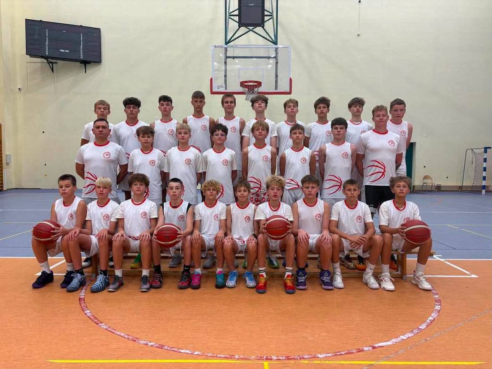

<nav class="lks-teamswitch" aria-label="Wybierz drużynę">
  <a class="lks-teamswitch__chip" href="../u11/">U11</a>
  <a class="lks-teamswitch__chip" href="../u12/">U12</a>
  <a class="lks-teamswitch__chip" href="../u13/">U13</a>
  <a class="lks-teamswitch__chip is-active" href="../u14/" aria-current="page">U14</a>
  <a class="lks-teamswitch__chip" href="../u15/">U15</a>
  <a class="lks-teamswitch__chip" href="../u17/">U17</a>
  <a class="lks-teamswitch__chip" href="../u19/">U19</a>
  <a class="lks-teamswitch__chip" href="../dwa-liga/">2 liga</a>
</nav>

# U14

{ .lks-team-photo }

Wzrost obciążeń treningowych, praca nad siłą funkcjonalną i taktyką zespołową na poziomie zaawansowanym.

:material-whistle-outline: **Trener prowadzący**
: **Maciej Rudziński**

:material-account-group-outline: **Wiek zawodników**
: ok. 13–14 lat

:material-phone-outline: **Kontakt do trenera**
: UZUPEŁNIJ numer telefonu

## :material-calendar-clock-outline: Harmonogram treningów

**Uzupełnij:** dni, godziny i halę tej grupy. Do czasu uzupełnienia tabela
poniżej pokazuje strukturę, a nie prawdziwe terminy.

| Dzień | Godziny | Hala |
|-------|---------|------|
| UZUPEŁNIJ | UZUPEŁNIJ | UZUPEŁNIJ |
| UZUPEŁNIJ | UZUPEŁNIJ | UZUPEŁNIJ |
| UZUPEŁNIJ | UZUPEŁNIJ | UZUPEŁNIJ |

Zmiany w harmonogramie zgłasza trener prowadzący bezpośrednio rodzicom
i zawodnikom. Przed wyjazdem na trening warto sprawdzić aktualności drużyny
na dole tej strony.

## :material-tent: Obozy i wyjazdy

**Uzupełnij:** terminy obozów i zgrupowań tej grupy, miejsce, koszt
organizacyjny i termin zapisów.

Obozy organizujemy w przerwie letniej i zimowej. Informacje o zapisach
przekazuje trener prowadzący, a szczegóły publikujemy w aktualnościach drużyny.

## :material-trophy-outline: Turnieje

**Uzupełnij:** najbliższe turnieje i mecze ligowe tej drużyny — data,
miejscowość, nazwa rozgrywek.

## :material-newspaper-variant-outline: Aktualności drużyny

Wyniki, relacje i komunikaty dotyczące U14 publikujemy
w [Aktualnościach](../aktualnosci/index.md).

## Chcesz dołączyć do tej grupy?

!!! info "Nabór indywidualny"
    Do tej grupy również przyjmujemy nowych zawodników. Zaczynamy od spotkania
    z trenerem prowadzącym: sprawdzamy poziom zawodnika i wspólnie oceniamy,
    czy drużyna będzie dla niego dobrym miejscem. Spotkanie umówisz przez biuro.

[Skontaktuj się z biurem](../dolacz.md){ .md-button .md-button--primary }
