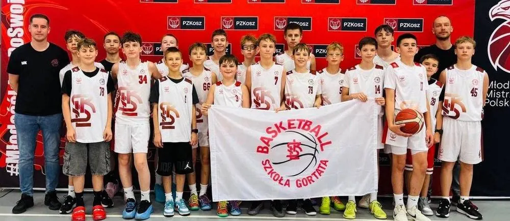

# ŁKS × Szkoła Gortata

{ .lks-team-photo width="1000" height="435" }

Szkoła Mistrzostwa Sportowego Marcina Gortata w Łodzi (ul. Siemiradzkiego i ul. Minerska) jest partnerem naszych drużyn **U11–U17**.

Szkoła Gortata to szkoła podstawowa i liceum. Żeby grać w naszych drużynach, nie trzeba być jej uczniem. Bycie uczniem i zawodnikiem jednocześnie daje jednak wiele korzyści: młody koszykarz nie musi wybierać między sportem a nauką.

## :material-basketball: Trening i nauka razem

Najtrudniej jest pogodzić kilka treningów w tygodniu z lekcjami,
sprawdzianami i odpoczynkiem. Dlatego plan lekcji jest dopasowany do treningów, a lekcje wychowania fizycznego to dodatkowe treningi koszykówki. Sport nie
odbywa się kosztem nauki, a nauka nie zamyka drogi do sportu.

## :material-school-outline: Co zapewnia szkoła

-   ### :material-home-city-outline: Bursa

    Zakwaterowanie dla uczniów spoza Łodzi. Mogą do nas dołączyć zawodnicy
    z całego regionu.

-   ### :material-head-heart-outline: Psycholodzy sportowi

    Wsparcie w radzeniu sobie z presją meczu, w budowaniu pewności siebie
    i w łączeniu sportu z nauką.

-   ### :material-translate: Więcej angielskiego

    Dodatkowe lekcje ponad program. Przydają się na turniejach i obozach
    za granicą, a później na studiach.

-   ### :material-whistle-outline: Więcej treningów

    Lekcje wychowania fizycznego to dodatkowe 4–5 treningów koszykówki z trenerem prowadzącym drużynę. Zawodnik trenuje więcej
    i regularniej.

-   ### :material-calendar-check-outline: Plan lekcji dopasowany do treningów

    Lekcje są ułożone tak, żeby dało się spokojnie połączyć naukę z treningami
    i odpoczynkiem.

## :material-star-outline: Co zyskuje zawodnik

- **Więcej koszykówki** — dodatkowe treningi na lekcjach wychowania fizycznego, obok treningów klubowych.
- **Plan lekcji dopasowany do treningów** — łatwiej pogodzić szkołę ze sportem.
- **Dobra nauka** — wykształcenie, które daje wybór, niezależnie od kariery
  sportowej.
- **Opieka poza boiskiem** — psycholodzy sportowi, a dla zawodników spoza
  Łodzi bursa.
- **Więcej angielskiego** — przydaje się w sporcie i poza nim.

## :material-account-heart-outline: Co zyskują rodzice

Pewność, że dziecko rozwija pasję w dobrze zorganizowanym otoczeniu,
a koszykówka nie konkuruje z nauką. Szkoła i Klub działają razem, więc
rodzinie łatwiej wszystko pogodzić. Dziecko nie musi być uczniem Szkoły
Gortata, żeby trenować w naszych drużynach.

## :material-map-marker-outline: Szkoła Gortata w Łodzi

-   ### :material-school: Ul. Siemiradzkiego

    Szkoła Mistrzostwa Sportowego Marcina Gortata w Łodzi.

    [:material-open-in-new: Łódź Siemiradzkiego](https://szkolagortata.pl/siemiradzkiego.html)

-   ### :material-school: Ul. Minerska

    Szkoła Mistrzostwa Sportowego Marcina Gortata w Łodzi.

    [:material-open-in-new: Łódź Minerska](https://szkolagortata.pl/minerska.html)

O rekrutacji przeczytasz na stronie szkoły.

## Chcesz połączyć szkołę z koszykówką?

Zadzwoń lub napisz do koordynatora — powie, jak dołączyć do drużyny
w roczniku Twojego dziecka.

:material-account-outline: **Koordynator organizacyjny — Maciej&nbsp;Kochaniak**
: [508 206 918](tel:+48508206918), [maciej.kochaniak@lkskm.pl](mailto:maciej.kochaniak@lkskm.pl)

:material-phone-outline: **Biuro Klubu**
: [733&nbsp;34&nbsp;**1908**](tel:+48733341908), [biuro@lkskm.pl](mailto:biuro@lkskm.pl) [Al. Unii Lubelskiej 2, 94-020 Łódź](https://www.google.com/maps/search/?api=1&query=Al.+Unii+Lubelskiej+2,+94-020+%C5%81%C3%B3d%C5%BA), II&nbsp;piętro

[Dołącz do naszego Klubu](dolacz.md){ .md-button .md-button--primary }
[Nasze drużyny](druzyny/index.md){ .md-button }
